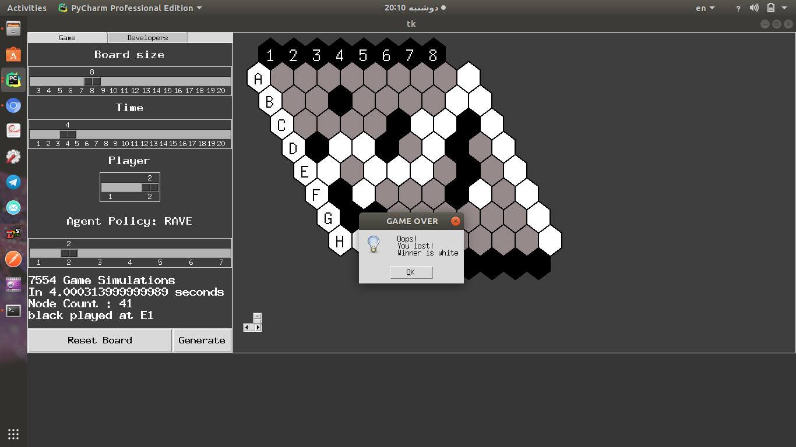

# Explanation

MONTE Carlo Tree Search (MCTS) is a method for finding optimal decisions in a given 
domain by taking random samples in the decision space and building a search tree accordingly. 
It has already had a profound impact on Artificial Intelligence (AI) approaches for domains 
that can be represented as trees of sequential decisions, particularly games and planning problems. 
In this project I used a board game called "HEX" as a platform to test different simulation strategies 
in MCTS field.

# Monte-Carlo-Tree-Search-Agent-for-the-Game-of-HEX
MONTE Carlo Tree Search (MCTS) is a method for finding optimal decisions in a 
given domain by taking random samples in the decision space and building a search 
tree according to the results. It has already had a profound impact on Artificial 
Intelligence (AI) approaches for domains that can be represented as trees of sequential
 decisions, particularly games and planning problems. In this project I used different 
 simulation strategies to enhance the agent policy to explore the environment.

The image above shows the basic framework

The image above shows the Cython framework. Obviously number of simulations shows the
 big difference between the cython and python versions

Video Tutorial

# Requirements
1- Operational System: linux (ubuntu is preferable)

2- cython

3- tkinter

4- numpy

Personally I installed Anaconda 3.6 on Ubuntu and thats it!
This is the link to install Anaconda:
https://www.anaconda.com/download/

# How to run it?

1- first remove modules.c and modules.so files. and then try this command `python setup.py build_ext --inplace`.

2- After new .so file is generated you can run the game using this command `python main.py` in the same directory

# How can I find a good resource for MCTS algorithm?
Try this link:

http://ieeexplore.ieee.org/abstract/document/6145622/

# How can I know better about the algorithms involved in this project?
The papers used for the project are here:

## UCB1-Tuned, UCT
P. Auer, N. Cesa-Bianchi, and P. Fischer, “Finite-time Analysis of the Multiarmed Bandit Problem,” 
Mach. Learn., vol. 47, no. 2, pp. 235–256, May 2002.

## LAST-Good-Reply Policy
P. D. Drake, “The Last-Good-Reply Policy for Monte-Carlo Go,” 
Int. Comp. Games Assoc. J., vol. 32, no. 4, pp. 221–227, 2009

## Decisive Moves and Anti Decisive moves
F. Teytaud and O. Teytaud, “On the Huge Benefit of Decisive Moves in Monte-Carlo Tree Search Algorithms,” 
IEEE Conf. Comput. Intell. Games, pp. 359–364, 2010.

## Rapid Action Value Estimation
1-S. Gelly and D. Silver, “Monte-Carlo tree search and rapid action value estimation in computer Go,”
 Artif. Intell., vol. 175, no. 11, pp. 1856–1876, 2011.
2- C. F. Sironi and M. H. M. Winands, “Comparison of Rapid Action Value Estimation Variants for General Game Playing,” 
IEEE Conf. Comput. Intell. Games, pp. 1–8, 2016.

## Quality-Based Rewards
T. Pepels, M. J. W. Tak, M. Lanctot, and M. H. M. Winands, 
“Quality-based Rewards for Monte-Carlo Tree Search Simulations,” 
Proc. Twenty-first Eur. Conf. Artif. Intell., pp. 705–710, 2014.

## Move-Average-Sampling-Technique
M. J. W. Tak, M. H. M. Winands, and Y. Björnsson, 
“N-Grams and the Last-Good-Reply Policy Applied in General Game Playing,” 
Trans. Comput. Intell. AI GAMES, vol. 4, no. 2, pp. 73–83, 2012.

## PoolRave
J.-B. Hoock, C.-S. Lee, A. Rimmel, F. Teytaud, O. Teytaud, and M.-H. Wang, 
“Intelligent Agents for the Game of Go,” IEEE Comput. Intell. Mag., vol. 5, no. 4, pp. 28–42, 2010.

I also will implement the threading-based Agent later.

In the Graphiacl user interface you can set the time for agent to search.

you also can increase the branch factor to test algorithms that how well they can 
interact with the environment and handle the complexity of world.

Pushing the button Generate will enable the tree to search the environment for the 
selected amount of time and come up with the best answer.

